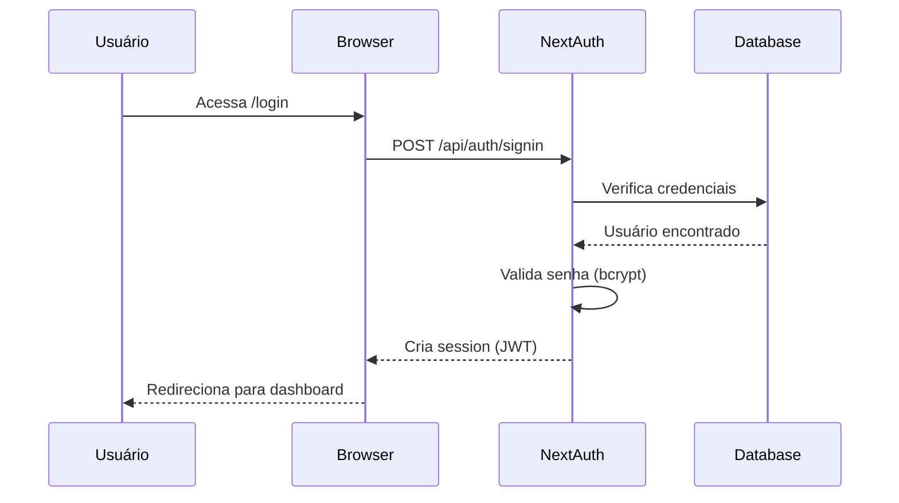
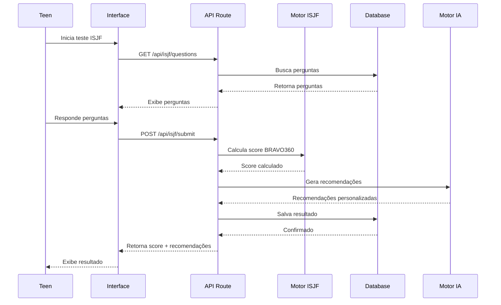

# 🏗️ Arquitetura do Sistema - DinDin Teens

## Visão Geral

O DinDin Teens é uma aplicação **monolítica moderna** construída com Next.js 14, seguindo a arquitetura de **App Router** com componentes Server e Client.

## Stack Tecnológica

### Frontend
```
Next.js 14 (App Router)
  └─ React 18 (Server + Client Components)
  └─ TypeScript
  └─ Tailwind CSS
  └─ Framer Motion (Animações)
  └─ Lucide Icons
```

### Backend
```
Next.js API Routes
  └─ RESTful APIs
  └─ NextAuth.js (Autenticação)
  └─ Prisma ORM
  └─ PostgreSQL
```

### Segurança
```
- bcryptjs (Hash de senhas)
- Zod (Validação de schemas)
- Rate Limiting (Proteção de APIs)
- CSRF Protection
- Input Sanitization (DOMPurify)
```

---

## Arquitetura de Camadas

```
┌─────────────────────────────────────────┐
│          CAMADA DE APRESENTAÇÃO           │
│  (Pages, Components, Layouts, Hooks)   │
└─────────────────────────────────────────┘
                    │
                    ↓
┌─────────────────────────────────────────┐
│          CAMADA DE API/SERVIÇOS          │
│      (API Routes, Business Logic)      │
└─────────────────────────────────────────┘
                    │
                    ↓
┌─────────────────────────────────────────┐
│         CAMADA DE LÓGICA DE NEGÓCIO       │
│   (ISJF Engine, Recommendations AI)   │
└─────────────────────────────────────────┘
                    │
                    ↓
┌─────────────────────────────────────────┐
│          CAMADA DE DADOS (ORM)          │
│             Prisma Client              │
└─────────────────────────────────────────┘
                    │
                    ↓
┌─────────────────────────────────────────┐
│         BANCO DE DADOS                 │
│     PostgreSQL (Supabase/Neon)        │
└─────────────────────────────────────────┘
```

---

## Fluxo de Autenticação



---

## Fluxo do ISJF Test



---

## Modelo de Dados (Principais Entidades)

### Core Entities
```
User
  ├─ TeenProfile
  ├─ ProfessorProfile
  ├─ ResponsibleProfile
  └─ UserProgress

EducationalInstitution
  └─ Class[]
      ├─ ProfessorClass[]
      └─ TeenClass[]

Activity
  └─ AtividadeProgresso[]

Badge
  └─ UserBadge[]

Message
  ├─ sender: User
  └─ receiver: User
```

### ISJF & Recommendations
```
ISJFResponse
  ├─ User
  ├─ isjfScore: Float
  ├─ dimensionScores: JSON
  └─ recommendations: JSON

CheckupTest
  ├─ User
  └─ StressorAssessment[]

RaioXTest
  ├─ User
  └─ diagnosis: JSON
```

---

## Padrões de Design

### 1. Server Components (Default)
```tsx
// Dashboard Server Component
export default async function DashboardPage() {
  const session = await getServerSession();
  const data = await prisma.user.findUnique(...);
  
  return <DashboardUI data={data} />;
}
```

### 2. Client Components (Interactive)
```tsx
'use client';

export function InteractiveChart({ data }) {
  const [filter, setFilter] = useState('all');
  // ... interactive logic
  return <Chart data={filteredData} />;
}
```

### 3. API Routes (RESTful)
```tsx
// GET /api/users/[id]
export async function GET(req, { params }) {
  const user = await prisma.user.findUnique({
    where: { id: params.id }
  });
  return NextResponse.json(user);
}
```

### 4. Middleware (Auth)
```tsx
// Protected API Route
export async function GET(req) {
  const session = await getServerSession();
  if (!session) return new Response('Unauthorized', { status: 401 });
  // ... business logic
}
```

---

## Sistema de Permissões

### Role-Based Access Control (RBAC)

| Role | Dashboard | Manage Classes | View Students | Messages |
|------|-----------|----------------|---------------|----------|
| TEEN | Teen | ❌ | ❌ | Own only |
| PROFESSOR | Professor | ✅ | ✅ | Students |
| RESPONSIBLE | Responsible | ❌ | Linked Teens | Teens |
| ADMIN | Admin | ✅ | ✅ | All |

### Implementação
```tsx
// Middleware de verificação
function requireRole(allowedRoles: UserRole[]) {
  return async (req: NextRequest) => {
    const session = await getServerSession();
    if (!session || !allowedRoles.includes(session.user.role)) {
      return new Response('Forbidden', { status: 403 });
    }
    return null;
  };
}
```

---

## Performance & Otimizações

### 1. Static Site Generation (SSG)
- Páginas estáticas (landing, sobre, FAQ)
- Build-time rendering

### 2. Incremental Static Regeneration (ISR)
- Conteúdo que muda pouco (atividades, badges)
- Revalidação periódica

### 3. Server-Side Rendering (SSR)
- Dashboards personalizados
- Dados dinâmicos por usuário

### 4. Caching
- Prisma query caching
- Next.js automatic caching
- Rate limiting cache

### 5. Code Splitting
- Automatic route-based splitting
- Dynamic imports para componentes pesados

### 6. Image Optimization
- Next.js Image component
- WebP/AVIF formats
- Lazy loading

---

## Escalabilidade

### Horizontal Scaling
- **Vercel**: Auto-scaling serverless functions
- **Database**: Connection pooling (pgBouncer)
- **CDN**: Assets estáticos via Vercel Edge Network

### Vertical Scaling
- **Database**: Upgrade de plano (Supabase/Neon)
- **Compute**: Mais resources por function

### Otimizações Futuras
- [ ] Redis cache layer
- [ ] GraphQL API (Apollo)
- [ ] WebSockets (real-time messaging)
- [ ] Queue system (Bull/BullMQ)
- [ ] Microservices (se necessário)

---

## Monitoramento & Observabilidade

### Logs
- **Console logs**: Development
- **Vercel logs**: Production
- **Sentry**: Error tracking (recomendado)

### Métricas
- **Vercel Analytics**: Core Web Vitals
- **Database metrics**: Query performance
- **API metrics**: Response times

### Alerts
- **Error rate**: > 1%
- **Response time**: > 2s
- **Database connections**: > 80%

---

## Segurança

### Autenticação
- NextAuth.js com JWT
- Session com expiração
- Refresh tokens (opcional)

### Autorização
- Role-based access control
- Resource-level permissions
- Hierarchical checks (institution → class → teen)

### Validação
- Zod schemas em todos os inputs
- Server-side validation obrigatória
- Sanitização de HTML

### Proteções
- Rate limiting por IP/user
- CSRF tokens
- SQL injection prevention (Prisma)
- XSS prevention (React + DOMPurify)

---

## Backup & Disaster Recovery

### Banco de Dados
- **Supabase**: Daily automatic backups
- **Manual backups**: `pg_dump` scripts
- **Point-in-time recovery**: Últimos 7 dias

### Código
- **Git**: Version control
- **GitHub**: Remote repository
- **Branches**: main (prod), develop (staging)

### Restore Procedure
1. Identify backup point
2. Stop application
3. Restore database
4. Restart application
5. Verify data integrity

---

## Roadmap Técnico

### Q1 2026
- [ ] Redis caching layer
- [ ] WebSockets para chat real-time
- [ ] Mobile app (React Native)

### Q2 2026
- [ ] Microservices architecture
- [ ] GraphQL API
- [ ] AI/ML models para recomendações avançadas

### Q3 2026
- [ ] Multi-tenant architecture
- [ ] White-label solution
- [ ] API pública para integrações

---

**Última atualização**: Janeiro 2026
